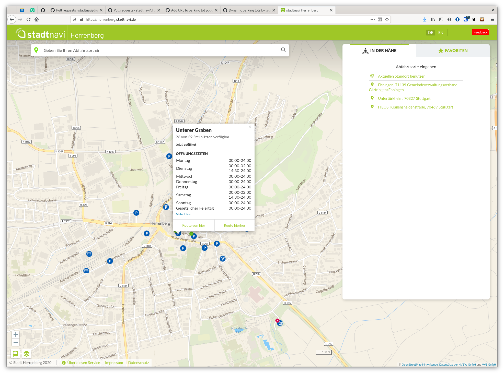
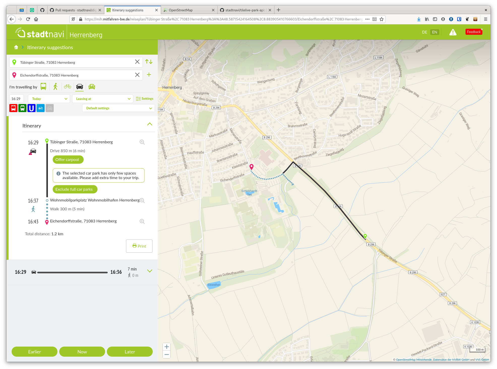
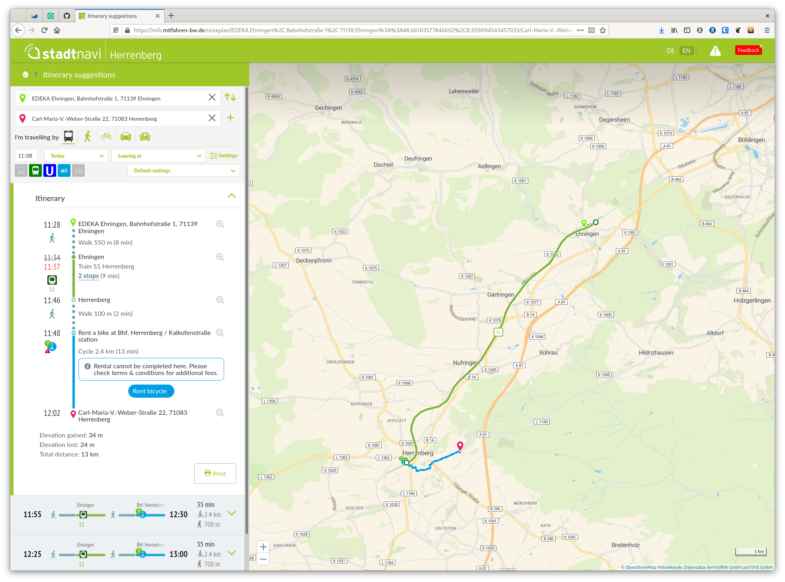

# Stadtnavi extensions

Stadtnavi has added the following features:

## Dynamic parking lots routing and map layer

This map layer adds information about car parking lots with realtime information about capacity, free spaces, opening hours and a link to more information.

All the information is drawn from a [ParkAPI](https://github.com/offenesdresden/ParkAPI) feed. Herrenberg's feed is available at: https://api.stadtnavi.de/parkapi.json

#### OpenTripPlanner

To add realtime parking lot information you need to [configure a ParkAPI updater](https://github.com/mfdz/OpenTripPlanner-data-container/commit/e2572ea5b526bedf0359b681f7e7391017f69db5).

More information about the possible configuration options can be found in the [OTP documentation](https://github.com/mfdz/OpenTripPlanner/blob/master/docs/Configuration.md#configuring-real-time-updaters).

#### Frontend

First, to visualise the parking lots, an instance of [tilelive-park-api](https://github.com/stadtnavi/tilelive-park-api) 
needs to be added to `hsl-map-server`.

The main frontend code resides in `DynamicParkingLots.js` and `DynamicParkingLotsPopup.js`.

If a parking lot is close to being full, then a warning is shown. The user may decide to re-run the routing query
excluding full car-parks.

This code lives in `CarLeg.js`.

#### Related pull requests & commits

- https://github.com/stadtnavi/digitransit-ui/pull/70
- https://github.com/stadtnavi/digitransit-ui/pull/74
- https://github.com/stadtnavi/digitransit-ui/pull/142
- https://github.com/stadtnavi/digitransit-ui/pull/277
- https://github.com/mfdz/OpenTripPlanner-data-container/commit/e2572ea5b526bedf0359b681f7e7391017f69db5

## Free-floating bicycle and scooter sharing

This allows digitransit to drop off bicycles and scooters anywhere and has two modes:

- The sharing system is not really a free-floating one, but bikes are allowed to be dropped off anywhere at the end of a journey. 
  In such a case the UI displays a warning. (`rentalMode=free-floating-with-temporary-dropoff`)
- The system is a proper free-floating one: you can drop off the bike anywhere. (`rentalMode=free-floating`)

**Notes** 

- If you switch from bike sharing to public transport, you cannot drop off the bike anywhere but only in a bike parking facility.
  This has two benefits:
   - The bikes are not dropped off in places that are absolutely closest to the station, ie. the tunnel underneath the 
     railway tracks or the steps leading to the subway entrance.
   - The search space is drastically reduced, leading to a speed up for routing requests.
- Business zones, restricting the drop off to a certain geographic area, are not supported.

### OpenTripPlanner

As with any other bike or car sharing, you need to [configure a graph updater](https://github.com/mfdz/OpenTripPlanner-data-container/blob/e2572ea/router-hb/router-config.json#L30-L38).

More information about the various rentalTypes are available in the [Configuration reference](https://github.com/mfdz/OpenTripPlanner/blob/master/docs/Configuration.md#gbfs-configuration).

### Map layer

The frontend is already part of digitransit and simply needs to be activated.

`hsl-map-server` however needs to be [configured to include](https://github.com/HSLdevcom/tilelive-otp-citybikes/blob/master/index.js#L47) 
the [`tilelive-citybike`](https://github.com/HSLdevcom/tilelive-otp-citybikes/).
This layer queries OTP for the bike positions. Please note that there is a bug (?) in this layer preventing frequent updates 
of positions: on top of the normal tile-based cache logic this layer also has its own cache, which never expires. 
(https://github.com/HSLdevcom/tilelive-otp-citybikes/blob/master/index.js#L47) 

### Frontend

If you are using the mode `free-floating-with-temporary-dropoff`, the backend emits warnings about having to return the
bicycle. To also put this feature into the frontend, please view the [relevant PR](https://github.com/stadtnavi/digitransit-ui/pull/277).
The main code resides in `BicycleLeg.js` but to you also need to change the client-side GraphQL schema file (`schema.json`) 
and the queries in `ItineraryTab.js` and `SummaryListContainer.js`.

### Related pull requests & commits

- https://github.com/mfdz/OpenTripPlanner-data-container/blob/e2572ea/router-hb/router-config.json#L30-L38
- https://github.com/stadtnavi/hsl-map-server/commit/d3a70b975c1c875d293e7400436b3fa283621854
- https://github.com/stadtnavi/digitransit-ui/pull/277
